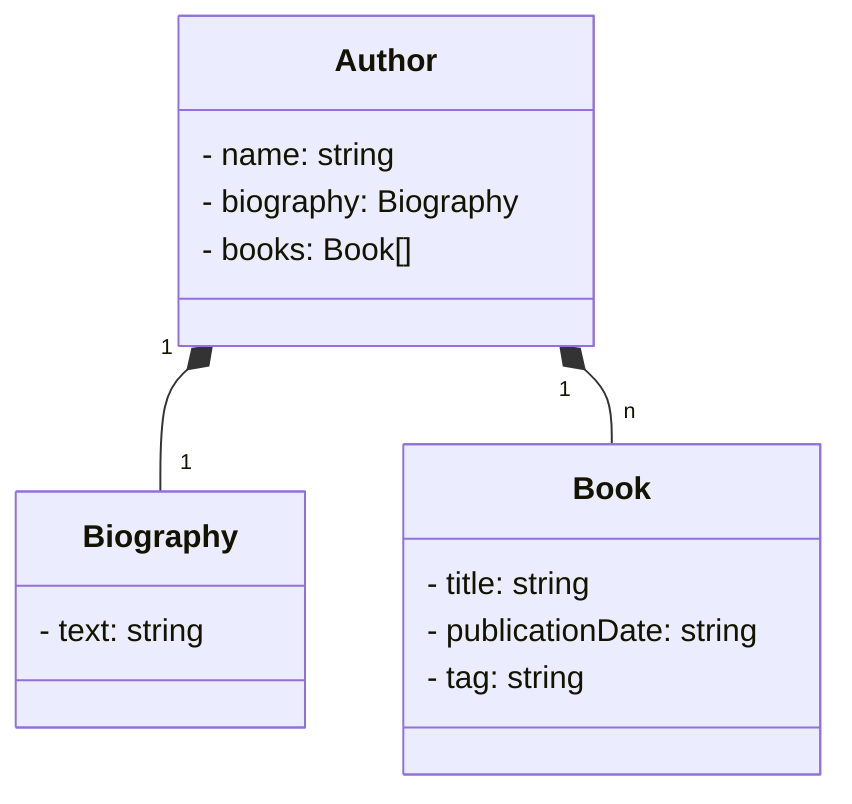

# Santander Bootcamp 2024

Java RESTFul criada para o bootcamp 2024.

Uma API de livraria simples que faz o cadastro, atualização, consulta e deleção de autores.

Com esta API, você tem os endpoints:

* `POST /authors`: cadastrar um novo autor.
* `POST /authors/{id}/books`: cadastrar um novo livro.
* `GET /authors`: recuperar todos os autores cadastrados.
* `GET /authors/{id}`: fazer a busca de um autor por ID.
* `GET /authors/{id}/books`: recuperar todos os livros cadastrados de um autor por ID.
* `PUT /authors/{id}`: atualizar informações de um autor específico e existente.
* `DELETE /authors/{id}`: deletar um autor.

_Author_ é uma entidade necessária e imprescindível nesse modelo de classes.
Seu relacionamento com _Biography_ é de 1 : 1. Seu relacionamento com _Book_ é de 1 : muitos.



## Erro "Application run failed"

Caso ocorra o erro `ERROR 12634` ao rodar o projeto, é necessário parar o uso da porta 8080.

`sudo netstat -tulnp | grep :8080` lista todas as portas utilizadas. A resposta será como `tcp        0      0 0.0.0.0:8080            0.0.0.0:*               OUÇA       ${PID}/docker-proxy `.
`sudo kill ${PID}`: encerra o uso.


## Configuração

Para que o vscode siga o script do arquivo de configuração, 
1. configure a variável de ambiente no _launch.json_, 
    1.1. Se não existe o arquivo _launch.json_ dentro da pasta vscode:
        1.1.a. dê o comando ctrol shift p e digite: "Java: Create Launch Configuration"
        1.1.b. clique sobre a opção listada "launch.json" e em "java" como depurador.
        1.1.c. será criado o arquivo _launch.json_ dentro da pasta vscode com algumas configurações iniciais.
        ```
        {
            "type": "java",
            "name": "Application",
            "request": "launch",
            "mainClass": "project.my.sbc2024.Application",
            "projectName": "sbc2024"
         },
        ```
        1.1.d. adicione um par de chaves o env a seguir:

### ambiente dev ([h2.console](http://localhost:8080/h2-console))

```
  "env": {
    "SPRING_PROFILES_ACTIVE": "dev",
  }

```
Ao rodar o projeto novamente, será exibido algo como "Hibernate: drop"... as tabelas foram criadas no banco de dados local.

### ambiente prod (railway.app)

Para que o ambiente de prod rode, é preciso substituir a env acima pela debaixo:

As informações foram geradas sem cadastro no app. Dados disponíveis somente por 24h.
Opção selecionada: Postgres.
Informações disponíveis na aba "variables".
Visualização de tabelas na aba "data".

Substitua "localhost","pgport","mydatabase","myusername" e "mypassword" pelas informadas na página do railway ao gerar um novo Postgres.

```
  "env": {
      "SPRING_PROFILES_ACTIVE": "prod",
      "PGHOST": "localhost",
      "PGPORT": "pgport",
      "PGDATABASE": "mydatabase",
      "PGUSER": "myusername",
      "PGPASSWORD": "mypassword"
  }

```

## Dependência swagger

Para não precisar fazer CRUD via CURL. Tem interface gráfica para consumir os endpoints.

`http://localhost:8080/swagger-ui.html`
